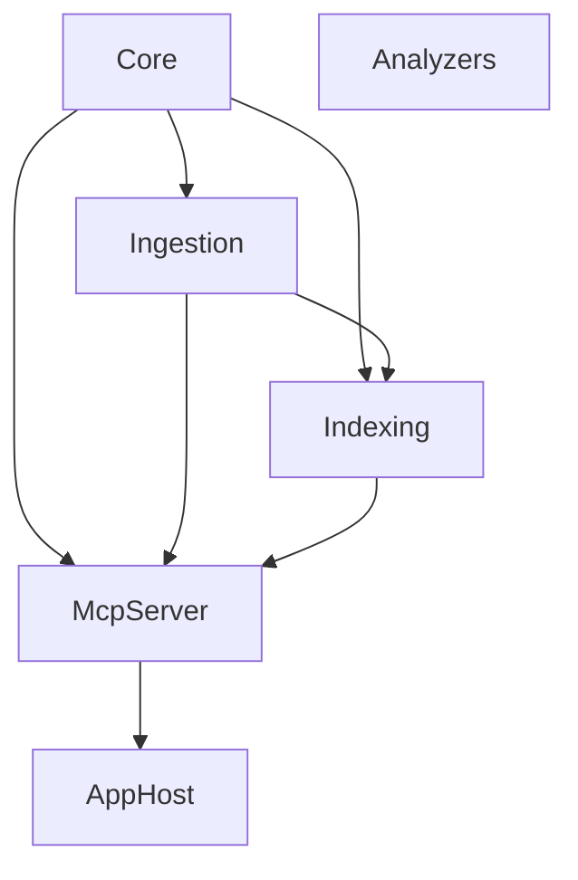
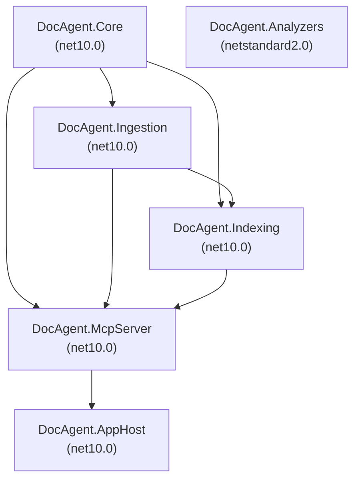

# Phase 22: Documentation Refresh - Research

**Researched:** 2026-03-03
**Domain:** Technical documentation authoring — refresh existing Markdown docs to match shipped codebase
**Confidence:** HIGH

---

<user_constraints>
## User Constraints (from CONTEXT.md)

### Locked Decisions

- **Document depth and tone:** Concise reference style — tables, diagrams, key facts (match CLAUDE.md style). Target audience: developers picking up the codebase. Reference CLAUDE.md rather than duplicate its content — docs add depth beyond the quick-start. Include Mermaid diagrams where they aid understanding (pipeline flow, layer dependencies).
- **Architecture.md structure:** Group 12 MCP tools by domain: DocTools, ChangeTools, SolutionTools, IngestionTools. Show full pipeline with interface names (IProjectSource → IDocSource → ISymbolGraphBuilder → etc.). Brief security section with pointer to Security.md for details. Include project dependency table showing which projects reference which.
- **Plan.md format:** Shipped summary for v1.0-v1.2 (accomplished milestones with key features) plus future plans for v1.3+. List MCP tools delivered per milestone. Preserve deferred/speculative items (polyglot, embeddings, query DSL) in a "Future" section.
- **Testing.md scope:** Strategy + how-to-run: test philosophy, category breakdown, commands, fixture patterns. Table of test categories: category, count, what it validates, example test class. Known Limitations section documenting environment-dependent test failures (MSBuild workspace tests).

### Claude's Discretion

- Exact Mermaid diagram content and layout
- Section ordering within each document
- How much cross-referencing between the three docs
- Whether to update Security.md or Worktrees.md (out of scope unless trivially stale)

### Deferred Ideas (OUT OF SCOPE)

None — discussion stayed within phase scope.
</user_constraints>

---

<phase_requirements>
## Phase Requirements

| ID | Description | Research Support |
|----|-------------|-----------------|
| DOCS-01 | Architecture.md reflects current 6-project structure and 12 MCP tools | Verified: 6 projects confirmed, 12 tool names extracted from source. Project dependency graph confirmed from .csproj references. |
| DOCS-02 | Plan.md updated to reflect v1.0-v1.2 shipped reality | Verified: Full list of shipped capabilities confirmed from PROJECT.md. Phantom items in current Plan.md identified. |
| DOCS-03 | Testing.md updated with current test count and strategy | Verified: 330 total tests (309 passing, 21 environment-dependent failures). 51 test files, categories identified. |
</phase_requirements>

---

## Summary

Phase 22 is a pure documentation update: no code changes, no new tests, no new files. The three target documents — `docs/Architecture.md`, `docs/Plan.md`, `docs/Testing.md` — were written at project start (2026-02-25) as planning artifacts and have never been updated to reflect the actual shipped system. Three milestones (v1.0, v1.1, v1.2) and a v1.3 cleanup phase have since shipped, adding 3 tool classes, 7 additional MCP tools, 3 Roslyn analyzers, solution-level ingestion, semantic diffing, incremental ingestion, and performance benchmarking. The current docs describe aspirations and placeholders, not reality.

The research task here is entirely codebase archaeology: extract ground truth from source code and git history, then verify what needs to change in each document. No external libraries or frameworks are involved — this is Markdown editing against a .NET codebase with Mermaid diagrams.

**Primary recommendation:** Work through one document at a time (Architecture → Plan → Testing), extracting facts from source code first, then writing. Do not edit from memory — verify every claim against the actual files.

---

## Ground Truth: What Was Actually Shipped

This section is the primary research output — extracted facts the planner and executor need.

### The 6 Projects

| Project | Folder | Target Framework | Role |
|---------|--------|-----------------|------|
| `DocAgent.Core` | `src/DocAgent.Core` | net10.0 | Pure domain types + interfaces (no IO) |
| `DocAgent.Ingestion` | `src/DocAgent.Ingestion` | net10.0 | Source discovery, XML parsing, Roslyn graph building, incremental engine |
| `DocAgent.Indexing` | `src/DocAgent.Indexing` | net10.0 | BM25 search index, snapshot store, project-aware querying |
| `DocAgent.McpServer` | `src/DocAgent.McpServer` | net10.0 | MCP tools, security (PathAllowlist, AuditLogger), IngestionService |
| `DocAgent.AppHost` | `src/DocAgent.AppHost` | net10.0 | Aspire app host, configuration, telemetry wiring |
| `DocAgent.Analyzers` | `src/DocAgent.Analyzers` | netstandard2.0 | Roslyn analyzers (DocCoverage, DocParity, SuspiciousEdit) |

**Confidence:** HIGH — verified directly from `src/` directory listing and `.csproj` files.

### Project Dependency Graph

Extracted from `ProjectReference` entries in `.csproj` files:

| Project | Depends On |
|---------|-----------|
| `DocAgent.Core` | (none — leaf) |
| `DocAgent.Ingestion` | `DocAgent.Core` |
| `DocAgent.Indexing` | `DocAgent.Core`, `DocAgent.Ingestion` |
| `DocAgent.McpServer` | `DocAgent.Core`, `DocAgent.Ingestion`, `DocAgent.Indexing` |
| `DocAgent.AppHost` | `DocAgent.McpServer` |
| `DocAgent.Analyzers` | (none — standalone Roslyn analyzer, netstandard2.0) |

**Confidence:** HIGH — verified directly from `.csproj` files.

### The 12 MCP Tools

Extracted from `[McpServerTool(Name = "...")]` attributes in `src/DocAgent.McpServer/Tools/`:

**DocTools** (`DocTools.cs`) — 5 tools:
| Tool Name | Method | Description |
|-----------|--------|-------------|
| `search_symbols` | `SearchSymbols` | Search symbols and documentation by keyword |
| `get_symbol` | `GetSymbol` | Get full symbol detail by stable SymbolId |
| `get_references` | `GetReferences` | Get symbols that reference the given symbol |
| `diff_snapshots` | `DiffSnapshots` | Diff two snapshot versions showing added/removed/modified symbols |
| `explain_project` | `ExplainProject` | Get a comprehensive project overview in one call |

**ChangeTools** (`ChangeTools.cs`) — 3 tools:
| Tool Name | Method | Description |
|-----------|--------|-------------|
| `review_changes` | `ReviewChanges` | Review all changes between two snapshot versions, grouped by severity with unusual pattern detection |
| `find_breaking_changes` | `FindBreakingChanges` | Find public API breaking changes between two snapshots (CI-optimized) |
| `explain_change` | `ExplainChange` | Get a detailed human-readable explanation of changes to a specific symbol between two snapshots |

**SolutionTools** (`SolutionTools.cs`) — 2 tools:
| Tool Name | Method | Description |
|-----------|--------|-------------|
| `explain_solution` | `ExplainSolution` | Solution-level architecture overview |
| `diff_solution_snapshots` | `DiffSnapshots` | Solution-level diff (wire name chosen to avoid collision with DocTools `diff_snapshots`) |

**IngestionTools** (`IngestionTools.cs`) — 2 tools:
| Tool Name | Method | Description |
|-----------|--------|-------------|
| `ingest_project` | `IngestProject` | Runtime ingestion trigger for a single project |
| `ingest_solution` | `IngestSolution` | Ingest an entire .sln solution with language filtering and TFM dedup |

**Total: 12 tools across 4 tool classes. Confidence:** HIGH — extracted directly from source attributes.

### The Pipeline (Interface Chain)

Confirmed from `DocAgent.Core` and `DocAgent.Ingestion`:

```
discover    → IProjectSource.DiscoverAsync()     → ProjectInventory
load docs   → IDocSource.LoadAsync()             → DocInputSet
build graph → ISymbolGraphBuilder.BuildAsync()   → SymbolGraphSnapshot
index       → ISearchIndex.IndexAsync()          → (indexed)
query       → IKnowledgeQueryService             → SearchHit / SymbolNode
diff        → SymbolGraphDiffer (static)         → GraphDiff
review      → ChangeReviewer (static)            → ReviewResult
serve       → McpServer tools                    → JSON/Markdown/Tron
```

Incremental path (v1.3): `IncrementalIngestionEngine` wraps `ISymbolGraphBuilder` with SHA-256 file manifest; `IncrementalSolutionIngestionService` decorates `SolutionIngestionService`.

**Confidence:** HIGH — interface names verified from source files.

### Test Suite Facts

Verified from `dotnet test` run (2026-03-03):

| Metric | Value |
|--------|-------|
| Total tests | 330 |
| Passing | 309 |
| Failing (environment-dependent) | 21 |
| Skipped | 0 |
| Test duration | ~64 seconds |

**Why 21 fail:** MSBuildWorkspace tests and the `RegressionGuardTests` require the actual MSBuild toolchain at runtime. They fail in environments where MSBuild cannot load the Roslyn MEF composition (seen in Docker/CI without `dotnet build` pre-warmed). The `Performance/RegressionGuardTests` benchmark runs also fail because BenchmarkDotNet's `ResultStatistics` is null when executed without a proper release-mode run context.

**51 test files** across these categories (approximate groupings):

| Category | Test Files | Example Class |
|----------|-----------|---------------|
| XML parsing + ingestion | 3 | `XmlDocParserTests`, `IngestionServiceTests`, `LocalProjectSourceTests` |
| Roslyn symbol graph | 2 | `RoslynSymbolGraphBuilderTests`, `InterfaceCompilationTests` |
| Search indexing | 3 | `BM25SearchIndexTests`, `BM25SearchIndexPersistenceTests`, `InMemorySearchIndexTests` |
| Snapshot serialization + store | 2 | `SnapshotSerializationTests`, `SnapshotStoreTests` |
| Incremental ingestion | 7 | `IncrementalIngestionEngineTests`, `SolutionIncrementalIngestionTests`, `DependencyCascadeTests`, etc. |
| Semantic diff | 8 | `SymbolGraphDifferTests`, `SignatureChangeTests`, `NullabilityChangeTests`, etc. |
| Change review | 2 | `ChangeReviewerTests`, `ChangeToolTests` |
| MCP tools + integration | 8 | `McpToolTests`, `McpIntegrationTests`, `SolutionToolTests`, `IngestionToolTests`, etc. |
| Security | 3 | `PathAllowlistTests`, `AuditLoggerTests`, `PromptInjectionScannerTests` |
| Solution-level | 5 | `SolutionIngestionServiceTests`, `SolutionIngestionToolTests`, `SolutionGraphEnrichmentTests`, etc. |
| Roslyn analyzers | 3 | `DocCoverageAnalyzerTests`, `DocParityAnalyzerTests`, `SuspiciousEditAnalyzerTests` |
| Performance / regression | 1 | `RegressionGuardTests` |
| E2E + determinism | 4 | `DeterminismTests`, `E2EIntegrationTests`, `IngestAndQueryE2ETests`, `CrossProjectQueryTests` |
| Other | 1 | `StdoutContaminationTests` |

**Confidence:** HIGH — test file list verified from filesystem, counts from `dotnet test` output.

---

## What the Current Docs Say vs. Reality

### Architecture.md — Current State

The current `docs/Architecture.md` (100 lines) describes the intended v1 architecture from 2026-02-25:
- Lists 6 layers but names them **Orchestration** (which doesn't exist as a project) and misses **DocAgent.Analyzers**
- Lists only 5 MCP tools (`search_symbols`, `get_symbol`, `get_references`, `diff_snapshots`, `explain_project`) — 7 tools missing
- Uses generic/aspirational interface signatures that may not match shipped code exactly
- No project dependency table
- No Mermaid diagrams
- No security section detail
- Storage section mentions "V1: write snapshots to artifacts/" — accurate, but underdeveloped
- Polymorphism section references `AddDocAgentCore()`, `AddDocAgentIngestion()`, `AddDocAgentMcpServer()` — verify these exist

**Gaps to close for DOCS-01:**
1. Replace layer list with accurate 6-project table (Core, Ingestion, Indexing, McpServer, AppHost, Analyzers)
2. Add project dependency table (from csproj research above)
3. Add all 12 MCP tools grouped by tool class
4. Add Mermaid pipeline diagram
5. Update interface signatures if needed
6. Add security section pointing to Security.md
7. Optionally: add incremental ingestion path note (v1.3)

### Plan.md — Current State

The current `docs/Plan.md` (146 lines) is the original planning document (dated 2026-02-25):
- Describes V1/V2/V3 as *future* plans — but V1 has shipped (and more)
- Lists package mapping as a V1 deliverable — **not shipped** (deferred to v1.5)
- Lists Git repo source (`GitRepoSource`) as V1 — **not shipped**
- Lists embeddings/vector index as V1 — **not shipped** (interface only)
- Missing all v1.1 and v1.2 accomplishments entirely
- Missing v1.3 Housekeeping work
- Uses "V1 goals" framing — should be "Shipped" for completed milestones

**Phantom features (listed as delivered but not shipped):**
- `GitRepoSource` (remote git repo cloning)
- `PackageRefGraph` / package mapping pipeline
- Embeddings implementation (IVectorIndex interface exists, no implementation)
- `IndexWriter` writing to `artifacts/index/`

**Missing accomplishments (shipped but not documented):**
- v1.1: Semantic diff engine, incremental file-level ingestion, ChangeReviewer, `review_changes` / `find_breaking_changes` / `explain_change` tools, PathAllowlist on ChangeTools
- v1.2: Solution-level types (SolutionSnapshot, ProjectEntry), `ingest_solution`, `explain_solution`, `diff_solution_snapshots`, cross-project edges, stub nodes, project-aware search, FQN disambiguation
- v1.3: Incremental solution-level re-ingestion (INGEST-01/02/03/04/05), BenchmarkDotNet performance benchmarks, regression guard tests, stale comment cleanup (QUAL-01/02/03)
- Roslyn analyzers (DocCoverage, DocParity, SuspiciousEdit) — listed as V1 goal but details wrong

**Gaps to close for DOCS-02:**
1. Restructure as milestone history: v1.0 Shipped | v1.1 Shipped | v1.2 Shipped | v1.3 In Progress
2. List MCP tools delivered per milestone
3. Remove phantom deliverables (GitRepoSource, PackageRefGraph, embeddings impl, IndexWriter path)
4. Move V2/V3 plans to a "Future Milestones" section; keep speculative items (polyglot, embeddings, query DSL)
5. Add v1.5 target: Package mapping (PKG-01/02)

### Testing.md — Current State

The current `docs/Testing.md` (30 lines) is a brief stub:
- No test counts — just category names
- Categories listed don't match actual test files (e.g., "Package mapping" listed, not shipped)
- No commands to run tests
- No fixture patterns documented
- No Known Limitations section
- No information about the 21 environment-dependent failures

**Gaps to close for DOCS-03:**
1. Add total test count (330 total, 309 passing, 21 environment-dependent)
2. Replace category list with accurate category table (category, count, what it validates, example class)
3. Add how-to-run commands (`dotnet test`, `dotnet test --filter`, etc.)
4. Add fixture patterns section (golden files, fixture repos, PipelineOverride seam)
5. Add Known Limitations section documenting MSBuildWorkspace and RegressionGuard failures
6. Update test philosophy to reflect actual TDD approach used

---

## Architecture Patterns

### Documentation Style (from CLAUDE.md and existing docs)

The project uses:
- Concise Markdown with tables as primary reference format
- Code blocks for interface signatures
- Mermaid diagrams for flow/dependency visualization
- No prose filler — every sentence carries information
- Section headers matching doc purpose

### Mermaid Diagram Guidance

For Architecture.md pipeline diagram (flowchart LR or TD):


For project dependency diagram (graph TD):


These are Claude's discretion per CONTEXT.md — adjust layout as needed for clarity.

### Cross-Referencing Strategy

- Architecture.md references Security.md for security details (brief section only)
- Plan.md references Architecture.md for interface names
- Testing.md references CLAUDE.md for commands (avoid duplicating build commands)
- Keep cross-references minimal — each doc should be independently readable

---

## Common Pitfalls

### Pitfall 1: Documenting the Plan, Not the Reality
**What goes wrong:** Writer uses Plan.md as a source of truth for what was built, perpetuating phantom features.
**Prevention:** Always verify against source files first. The ground truth list in this research document supersedes the old Plan.md entirely.

### Pitfall 2: Wrong Test Counts
**What goes wrong:** Counting test *files* instead of test *methods*, or running stale cached results.
**Prevention:** Run `dotnet test` fresh and use the summary line output. Current verified count: 330 total (309 pass, 21 fail).

### Pitfall 3: Tool Name Errors
**What goes wrong:** Using the method name instead of the wire name (e.g., `DiffSnapshots` instead of `diff_solution_snapshots`).
**Prevention:** Always use the `Name = "..."` value from `[McpServerTool(Name = "...")]` attributes, not the C# method name. See ground truth list above.

### Pitfall 4: Missing the Analyzers Project
**What goes wrong:** Architecture doc lists 5 projects (Core/Ingestion/Indexing/McpServer/AppHost) and omits DocAgent.Analyzers.
**Prevention:** The current Architecture.md lists "Orchestration" as a layer that doesn't exist. Replace with accurate 6-project list.

### Pitfall 5: Over-documenting Future Plans
**What goes wrong:** V2/V3 future plans get equal prominence to shipped work, confusing readers about current state.
**Prevention:** Shipped milestones (v1.0-v1.2) get full detail sections. Future (v2+) gets a brief "Future Milestones" section only.

---

## Don't Hand-Roll

| Problem | Don't Build | Use Instead |
|---------|-------------|-------------|
| Mermaid syntax | Custom ASCII art diagrams | Standard Mermaid flowchart/graph TD syntax — renders in GitHub and most Markdown viewers |
| Test count | Manual count from file listing | `dotnet test` summary output line |
| Tool names | Memory or method names | `[McpServerTool(Name = "...")]` attributes in source |
| Shipped features list | Old Plan.md or memory | `PROJECT.md` Requirements section (verified ground truth) |

---

## Code Examples

### Mermaid Project Dependency Diagram (draft)



### Run Commands for Testing.md

```bash
# Run all tests
dotnet test src/DocAgentFramework.sln

# Run excluding environment-dependent tests
dotnet test --filter "Category!=MSBuildWorkspace"

# Run a single test class
dotnet test --filter "FullyQualifiedName~XmlDocParserTests"

# Run only incremental ingestion tests
dotnet test --filter "FullyQualifiedName~IncrementalIngestion"
```

Note: The MSBuildWorkspace exclusion filter is illustrative — verify the actual [Trait] category name used in the test files before documenting.

---

## Open Questions

1. **MSBuildWorkspace trait name**
   - What we know: 21 tests fail due to MSBuildWorkspace/BenchmarkDotNet runtime constraints
   - What's unclear: Whether there is a `[Trait("Category", "MSBuildWorkspace")]` or similar attribute that enables filter-based exclusion
   - Recommendation: Check test files for `[Trait]` attributes before documenting the filter command in Testing.md. If no trait exists, document as "known failures" without a filter command.

2. **ServiceCollectionExtensions names**
   - What we know: Architecture.md references `AddDocAgentCore()`, `AddDocAgentIngestion()`, `AddDocAgentMcpServer()`
   - What's unclear: Whether these are the actual extension method names in `ServiceCollectionExtensions.cs`
   - Recommendation: Verify from `src/DocAgent.McpServer/ServiceCollectionExtensions.cs` before including in Architecture.md.

3. **AppHost project details**
   - What we know: AppHost depends only on McpServer; runs the Aspire host
   - What's unclear: Whether there is meaningful architecture content beyond "Aspire app host" worth documenting
   - Recommendation: Keep Architecture.md AppHost section brief — it's orchestration glue, not domain logic.

---

## State of the Art

| Old Approach (docs say) | Current Reality | Impact |
|------------------------|-----------------|--------|
| 5 MCP tools | 12 MCP tools | Architecture.md tool list 7 tools incomplete |
| V1 plan as future | v1.0-v1.2 shipped | Plan.md is a planning artifact, not a shipped record |
| "Package mapping" as V1 deliverable | Deferred to v1.5 | Plan.md lists phantom feature |
| No test count | 330 tests (309 passing) | Testing.md has no numbers |
| "End-to-end tests: start MCP server" | In-proc server for component tests | Testing.md describes aspirational approach |
| No Known Limitations | 21 env-dependent failures | Testing.md missing accuracy on failure context |
| 5 projects | 6 projects (+ DocAgent.Analyzers) | Architecture.md missing entire project |

---

## Sources

### Primary (HIGH confidence)
- `src/DocAgent.McpServer/Tools/DocTools.cs` — 5 tool names and descriptions verified from `[McpServerTool]` attributes
- `src/DocAgent.McpServer/Tools/ChangeTools.cs` — 3 tool names verified
- `src/DocAgent.McpServer/Tools/SolutionTools.cs` — 2 tool names verified
- `src/DocAgent.McpServer/Tools/IngestionTools.cs` — 2 tool names verified
- `src/*.csproj` files — project dependency graph verified from `ProjectReference` entries
- `dotnet test` output (2026-03-03) — 330 total, 309 passing, 21 failing
- `tests/DocAgent.Tests/` filesystem — 51 test files enumerated
- `docs/Architecture.md` — current state documented (100 lines, aspirational)
- `docs/Plan.md` — current state documented (146 lines, aspirational)
- `docs/Testing.md` — current state documented (30 lines, stub)
- `.planning/PROJECT.md` — shipped requirements list (verified ground truth for Plan.md update)
- `.planning/phases/22-documentation-refresh/22-CONTEXT.md` — user decisions

### Secondary (MEDIUM confidence)
- Git log — milestone history (v1.0, v1.1, v1.2, v1.3) corroborates PROJECT.md

---

## Metadata

**Confidence breakdown:**
- Ground truth facts (tools, projects, test counts): HIGH — extracted directly from source code and test runner
- Document gap analysis: HIGH — compared current docs line-by-line against source truth
- Mermaid diagram drafts: MEDIUM — correct facts, exact layout is Claude's discretion
- MSBuild trait filter command: LOW — placeholder, requires verification against test file attributes

**Research date:** 2026-03-03
**Valid until:** 2026-04-03 (stable codebase — no changes expected before Phase 22 executes)
