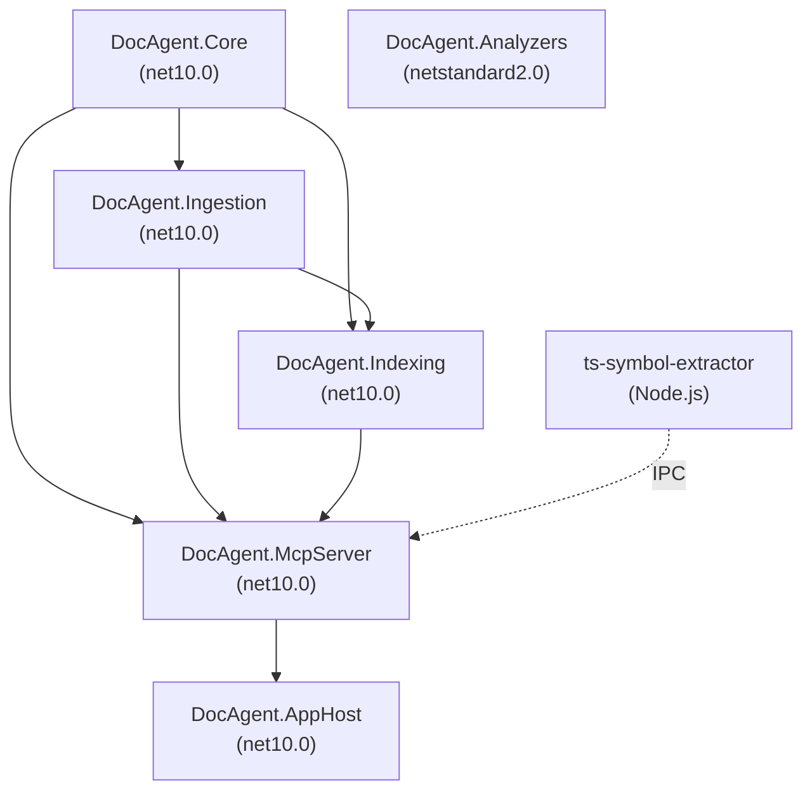

# Architecture

DocAgentFramework ingests code documentation and symbol data for .NET and TypeScript, normalizes it into a queryable symbol graph, and serves it via a securable MCP server.

---

## Projects

| Project | Target Framework | Responsibility |
|---------|-----------------|----------------|
| `DocAgent.Core` | net10.0 | Pure domain types and interfaces — no IO |
| `DocAgent.Ingestion` | net10.0 | Source discovery, XML parsing, Roslyn graph building, incremental engine |
| `DocAgent.Indexing` | net10.0 | BM25 search index, snapshot store, project-aware querying |
| `DocAgent.McpServer` | net10.0 | MCP tools, security (PathAllowlist, AuditLogger), IngestionService |
| `DocAgent.AppHost` | net10.0 | Aspire app host, configuration, telemetry wiring |
| `DocAgent.Analyzers` | netstandard2.0 | Roslyn analyzers: DocCoverage, DocParity, SuspiciousEdit |
| `ts-symbol-extractor` | Node.js (ESM) | TypeScript sidecar: extracts symbols using TypeScript Compiler API |

---

## Project Dependencies

| Project | Depends On |
|---------|-----------|
| `DocAgent.Core` | (none — leaf) |
| `DocAgent.Ingestion` | `DocAgent.Core` |
| `DocAgent.Indexing` | `DocAgent.Core`, `DocAgent.Ingestion` |
| `DocAgent.McpServer` | `DocAgent.Core`, `DocAgent.Ingestion`, `DocAgent.Indexing`, `ts-symbol-extractor` (runtime) |
| `DocAgent.AppHost` | `DocAgent.McpServer` |
| `DocAgent.Analyzers` | (none — standalone, netstandard2.0) |



---

## Pipeline

The standard ingestion and query pipeline:

```
IProjectSource (C#) / tsconfig.json (TS) → ISymbolGraphBuilder (Roslyn/Sidecar) → ISearchIndex → IKnowledgeQueryService → MCP Tools
```

Incremental path: SHA-256 based file hashing ensures that only changed files (or projects in a solution) trigger a full re-parse. Cache hits are served directly from the `SnapshotStore` in < 100ms.

---

## MCP Tools

All 15 tools exposed by `DocAgent.McpServer`, grouped by class:

### DocTools (6)

| Tool Name | Description |
|-----------|-------------|
| `search_symbols` | Search symbols and documentation by keyword (BM25) |
| `get_symbol` | Get full symbol detail by stable SymbolId |
| `get_references` | Get symbols that reference the given symbol |
| `find_implementations` | Locate implementations of interfaces or derived classes |
| `get_doc_coverage` | Audit documentation completion for a project or namespace |
| `explain_project` | Get a comprehensive project overview in one call |

### ChangeTools (3)

| Tool Name | Description |
|-----------|-------------|
| `review_changes` | Review all changes between two snapshot versions |
| `find_breaking_changes` | Find public API breaking changes between two snapshots |
| `explain_change` | Detailed explanation of changes to a specific symbol |

### SolutionTools (2)

| Tool Name | Description |
|-----------|-------------|
| `explain_solution` | Solution-level architecture overview |
| `diff_solution_snapshots` | Solution-level diff across all projects |

### IngestionTools (3)

| Tool Name | Description |
|-----------|-------------|
| `ingest_project` | Runtime ingestion trigger for a single .NET project |
| `ingest_solution` | Ingest an entire .sln solution |
| `ingest_typescript` | Ingest a TypeScript project via tsconfig.json |

---

## Security

MCP tool calls are gated by a default-deny `PathAllowlist` that restricts file system access to declared paths. Every tool call is recorded by `AuditLogger`. TypeScript ingestion involves spawning a Node.js process, which is handled via a secure NDJSON IPC protocol with strict timeout and resource limits.

---

## Storage

Snapshots are written to the `artifacts/` directory using MessagePack serialization via streaming (`MessagePackSerializer.SerializeAsync` / `DeserializeAsync`). Each project snapshot is immutable and addressed by a content-based hash (XxHash128). Streaming serialization avoids the 2 GB `byte[]` limit, enabling ingestion of large solutions that produce multi-gigabyte snapshots.

During solution ingestion, each project snapshot is written to `SnapshotStore` as `{hash}.msgpack` immediately after that project finishes processing, before the merged solution snapshot is assembled. This per-project checkpoint behaviour means partial results are preserved even if ingestion is interrupted mid-solution.

`SolutionSnapshot.ProjectSnapshots` holds `ProjectSnapshotSummary` records (name, path, `NodeCount`, `EdgeCount`, `ContentHash`) rather than full `SymbolGraphSnapshot` objects. Full per-project snapshots are still persisted on disk and can be loaded on demand; the summary avoids keeping all projects in memory simultaneously.

---

## Ingestion Filtering

By default, test source files are excluded from symbol extraction to reduce graph size for large solutions. The `TestFileFilter` helper skips files matching common test suffixes (`*Tests.cs`, `*Fixture.cs`, `*Spec.cs`, `*Steps.cs`, etc.) while always including `Base*` files. This behaviour is controlled by `DocAgentServerOptions.ExcludeTestFiles` (default: `true`) and can be overridden per ingestion call.

---

## Tools & Scripts Ingestion (v2.3.0)

Nine static parsers in `DocAgent.McpServer.Ingestion` extract symbols from non-C# artifacts:

| Parser | Input | SymbolKind(s) Produced |
|--------|-------|----------------------|
| `DotnetToolsParser` | `.config/dotnet-tools.json` | Tool |
| `MSBuildFileParser` | `.targets`, `.props` | BuildTarget, BuildProperty, BuildTask |
| `ToolScriptDiscovery` | (discovery) | — |
| `PowerShellScriptParser` | `.ps1` | Script, ScriptFunction, ScriptParameter |
| `CIWorkflowParser` | GitHub Actions / Azure Pipelines YAML | CIWorkflow, CIJob, CIStep |
| `ShellScriptParser` | `.sh`, `.bash` | Script, ScriptFunction |
| `DockerfileParser` | `Dockerfile` | DockerStage, DockerInstruction |
| `CrossLanguageEdgeDetector` | SymbolGraphSnapshot | (edges only) |
| `SnapshotEnricher` | SymbolGraphSnapshot | (enrichment) |

All parsers are pure static classes with no DI. They return `(IReadOnlyList<SymbolNode>, IReadOnlyList<SymbolEdge>)`.

Edge kinds used: `Invokes`, `Configures`, `DependsOn`, `Triggers`, `Imports`, `Contains`, `References`.

---

## TypeScript Sidecar Architecture

DocAgentFramework supports TypeScript ingestion via a Node.js sidecar process that uses the TypeScript Compiler API to extract symbols, types, and documentation from TypeScript projects.

### Node.js Sidecar Design

| Aspect | Detail |
|--------|--------|
| Location | `src/ts-symbol-extractor/` (standalone Node.js ESM project) |
| Build | Bundled to `dist/index.js` via esbuild for single-file deployment |
| Host integration | `TypeScriptIngestionService` (C#) spawns the sidecar as a child process |
| Communication | JSON-RPC 2.0 over stdin/stdout; all sidecar logging goes to stderr |
| Parser | Uses `ts.createProgram` from the TypeScript Compiler API to parse `tsconfig.json` projects |
| Lifecycle | Spawned per-ingestion call; exits after producing output |

### NDJSON Protocol Definition

The sidecar communicates using newline-delimited JSON-RPC 2.0 messages:

**Request** (C# to Node.js, one JSON object on stdin):
```json
{ "jsonrpc": "2.0", "id": 1, "method": "extract", "params": { "tsconfigPath": "/abs/path/tsconfig.json", "outputPath": "/tmp/output.json" } }
```

**Response** (Node.js to C#, one JSON object on stdout):
```json
{ "jsonrpc": "2.0", "id": 1, "result": { "nodes": [...], "edges": [...], ... } }
```

| Parameter | Required | Description |
|-----------|----------|-------------|
| `tsconfigPath` | Yes | Absolute path to the `tsconfig.json` file to parse |
| `outputPath` | No | When set, writes the response to a file instead of stdout (bypasses pipe buffer limits for large projects) |

**Error codes** (standard JSON-RPC 2.0):

| Code | Meaning |
|------|---------|
| -32700 | Parse error (malformed JSON input) |
| -32600 | Invalid request (missing required fields) |
| -32601 | Method not found (unsupported method name) |
| -32603 | Internal error (TypeScript compilation failure) |

### TypeScript Symbol Mapping Strategy

TypeScript constructs are mapped to the unified `SymbolNode` / `SymbolEdge` model:

| TypeScript Construct | SymbolKind | SymbolId Prefix |
|---------------------|------------|-----------------|
| Source file | `Namespace` | `N` |
| Class, Interface, Enum, Type alias | `Type` | `T` |
| Function, Method | `Method` | `M` |
| Property | `Property` | `P` |
| Field, Variable | `Field` | `F` |
| Enum member | `EnumMember` | `E` |

**SymbolId format:** `{prefix}:{projectName}:{relativePath}:{symbolName}` (e.g., `T:myapp:src/utils.ts:Helper`)

**Edge mapping:**

| TypeScript Relationship | SymbolEdgeKind |
|------------------------|----------------|
| `extends` (class) | `InheritsFrom` |
| `implements` (interface) | `Implements` |
| `import` / `require` | `References` |
| Containment (class member) | `Contains` |

**Documentation mapping:** JSDoc/TSDoc tags map to `DocComment` fields: `@param` to params, `@returns` to returns, `@example` to example, `@throws` to throws, `@see` to see, `@remarks` to remarks. The summary is the first paragraph before any tag.

**Visibility:** Exported symbols are mapped to `Public` accessibility; non-exported symbols are `Internal`.

**Exclusions:** `node_modules/` directories and `.d.ts` declaration files are excluded from extraction.
