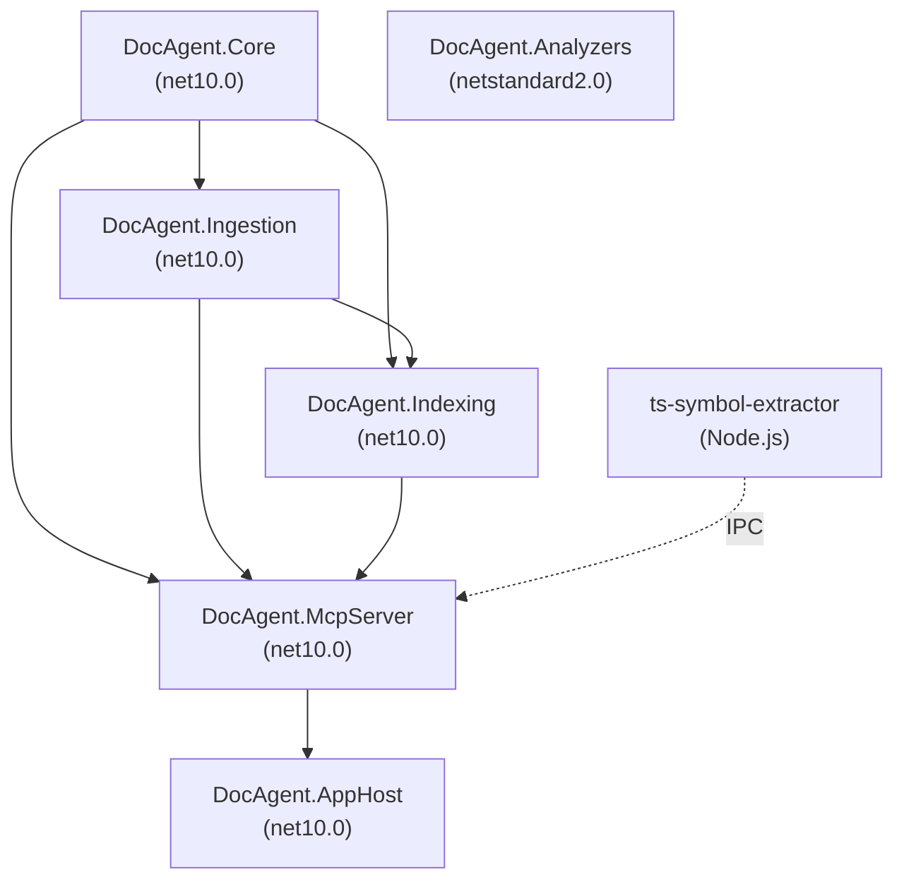

# Architecture

DocAgentFramework ingests code documentation and symbol data for .NET and TypeScript, normalizes it into a queryable symbol graph, and serves it via a securable MCP server.

---

## Projects

| Project | Target Framework | Responsibility |
|---------|-----------------|----------------|
| `DocAgent.Core` | net10.0 | Pure domain types and interfaces — no IO |
| `DocAgent.Ingestion` | net10.0 | Source discovery, XML parsing, Roslyn graph building, incremental engine |
| `DocAgent.Indexing` | net10.0 | BM25 search index, snapshot store, project-aware querying |
| `DocAgent.McpServer` | net10.0 | MCP tools, security (PathAllowlist, AuditLogger), IngestionService |
| `DocAgent.AppHost` | net10.0 | Aspire app host, configuration, telemetry wiring |
| `DocAgent.Analyzers` | netstandard2.0 | Roslyn analyzers: DocCoverage, DocParity, SuspiciousEdit |
| `ts-symbol-extractor` | Node.js (ESM) | TypeScript sidecar: extracts symbols using TypeScript Compiler API |

---

## Project Dependencies

| Project | Depends On |
|---------|-----------|
| `DocAgent.Core` | (none — leaf) |
| `DocAgent.Ingestion` | `DocAgent.Core` |
| `DocAgent.Indexing` | `DocAgent.Core`, `DocAgent.Ingestion` |
| `DocAgent.McpServer` | `DocAgent.Core`, `DocAgent.Ingestion`, `DocAgent.Indexing`, `ts-symbol-extractor` (runtime) |
| `DocAgent.AppHost` | `DocAgent.McpServer` |
| `DocAgent.Analyzers` | (none — standalone, netstandard2.0) |



---

## Pipeline

The standard ingestion and query pipeline:

```
IProjectSource (C#) / tsconfig.json (TS) → ISymbolGraphBuilder (Roslyn/Sidecar) → ISearchIndex → IKnowledgeQueryService → MCP Tools
```

Incremental path: SHA-256 based file hashing ensures that only changed files (or projects in a solution) trigger a full re-parse. Cache hits are served directly from the `SnapshotStore` in < 100ms.

---

## MCP Tools

All 15 tools exposed by `DocAgent.McpServer`, grouped by class:

### DocTools (6)

| Tool Name | Description |
|-----------|-------------|
| `search_symbols` | Search symbols and documentation by keyword (BM25) |
| `get_symbol` | Get full symbol detail by stable SymbolId |
| `get_references` | Get symbols that reference the given symbol |
| `find_implementations` | Locate implementations of interfaces or derived classes |
| `get_doc_coverage` | Audit documentation completion for a project or namespace |
| `explain_project` | Get a comprehensive project overview in one call |

### ChangeTools (3)

| Tool Name | Description |
|-----------|-------------|
| `review_changes` | Review all changes between two snapshot versions |
| `find_breaking_changes` | Find public API breaking changes between two snapshots |
| `explain_change` | Detailed explanation of changes to a specific symbol |

### SolutionTools (2)

| Tool Name | Description |
|-----------|-------------|
| `explain_solution` | Solution-level architecture overview |
| `diff_solution_snapshots` | Solution-level diff across all projects |

### IngestionTools (4)

| Tool Name | Description |
|-----------|-------------|
| `ingest_project` | Runtime ingestion trigger for a single .NET project |
| `ingest_solution` | Ingest an entire .sln solution |
| `ingest_typescript` | Ingest a TypeScript project via tsconfig.json |
| `find_breaking_changes` | (Redundant listing, moved to ChangeTools) |

---

## Security

MCP tool calls are gated by a default-deny `PathAllowlist` that restricts file system access to declared paths. Every tool call is recorded by `AuditLogger`. TypeScript ingestion involves spawning a Node.js process, which is handled via a secure NDJSON IPC protocol with strict timeout and resource limits.

---

## Storage

Snapshots are written to the `artifacts/` directory using MessagePack or JSON serialization. Each project snapshot is immutable and addressed by a content-based hash (SHA-256).
