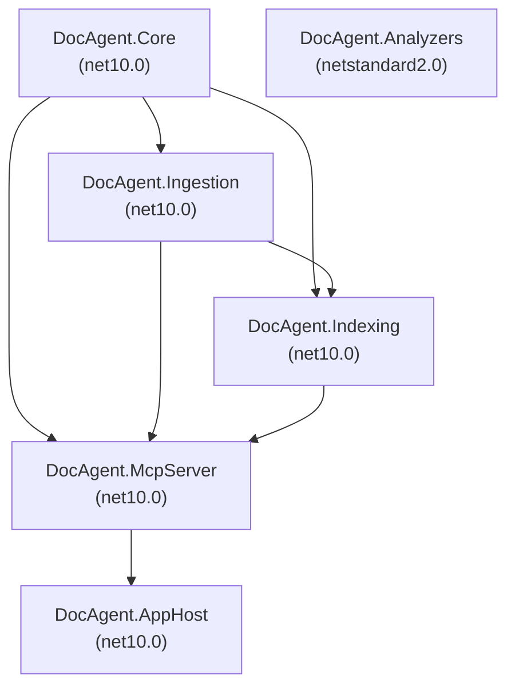
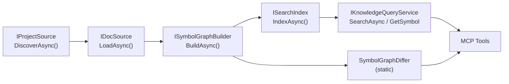

# Architecture

DocAgentFramework ingests code documentation and Roslyn symbol data, normalizes it into a queryable symbol graph, and serves it via a securable MCP server. See `CLAUDE.md` for quick-start commands.

---

## Projects

| Project | Target Framework | Responsibility |
|---------|-----------------|----------------|
| `DocAgent.Core` | net10.0 | Pure domain types and interfaces — no IO |
| `DocAgent.Ingestion` | net10.0 | Source discovery, XML parsing, Roslyn graph building, incremental engine |
| `DocAgent.Indexing` | net10.0 | BM25 search index, snapshot store, project-aware querying |
| `DocAgent.McpServer` | net10.0 | MCP tools, security (PathAllowlist, AuditLogger), IngestionService |
| `DocAgent.AppHost` | net10.0 | Aspire app host, configuration, telemetry wiring |
| `DocAgent.Analyzers` | netstandard2.0 | Roslyn analyzers: DocCoverage, DocParity, SuspiciousEdit |

---

## Project Dependencies

| Project | Depends On |
|---------|-----------|
| `DocAgent.Core` | (none — leaf) |
| `DocAgent.Ingestion` | `DocAgent.Core` |
| `DocAgent.Indexing` | `DocAgent.Core`, `DocAgent.Ingestion` |
| `DocAgent.McpServer` | `DocAgent.Core`, `DocAgent.Ingestion`, `DocAgent.Indexing` |
| `DocAgent.AppHost` | `DocAgent.McpServer` |
| `DocAgent.Analyzers` | (none — standalone, netstandard2.0) |



---

## Pipeline

The standard ingestion and query pipeline:

```
IProjectSource → IDocSource → ISymbolGraphBuilder → ISearchIndex → IKnowledgeQueryService → MCP Tools
```

Incremental path (v1.3): `IncrementalIngestionEngine` wraps `ISymbolGraphBuilder` with a SHA-256 file manifest to skip unchanged files. `IncrementalSolutionIngestionService` decorates `SolutionIngestionService` with pointer-file state.



---

## MCP Tools

All 12 tools exposed by `DocAgent.McpServer`, grouped by class:

### DocTools (5)

| Tool Name | Description |
|-----------|-------------|
| `search_symbols` | Search symbols and documentation by keyword |
| `get_symbol` | Get full symbol detail by stable SymbolId |
| `get_references` | Get symbols that reference the given symbol |
| `diff_snapshots` | Diff two snapshot versions showing added/removed/modified symbols |
| `explain_project` | Get a comprehensive project overview in one call |

### ChangeTools (3)

| Tool Name | Description |
|-----------|-------------|
| `review_changes` | Review all changes between two snapshot versions, grouped by severity with unusual pattern detection |
| `find_breaking_changes` | Find public API breaking changes between two snapshots (CI-optimized) |
| `explain_change` | Get a detailed human-readable explanation of changes to a specific symbol between two snapshots |

### SolutionTools (2)

| Tool Name | Description |
|-----------|-------------|
| `explain_solution` | Solution-level architecture overview |
| `diff_solution_snapshots` | Solution-level diff across all projects |

### IngestionTools (2)

| Tool Name | Description |
|-----------|-------------|
| `ingest_project` | Runtime ingestion trigger for a single project |
| `ingest_solution` | Ingest an entire .sln solution with language filtering and TFM dedup |

---

## Security

MCP tool calls are gated by a default-deny `PathAllowlist` that restricts file system access to declared paths. Every tool call is recorded by `AuditLogger` with tool name, requester identity, duration, and status. Incoming prompt arguments are scanned by `PromptInjectionScanner` before execution.

See `docs/Security.md` for the full security model, threat scope, and configuration details.

---

## Storage

Snapshots are written to the `artifacts/` directory using MessagePack serialization. Each snapshot is immutable and addressed by a version identifier. Incremental ingestion uses pointer files (`latest-{project}.ptr`, `latest-{sln}.ptr`) to track the previous snapshot reference across runs.
